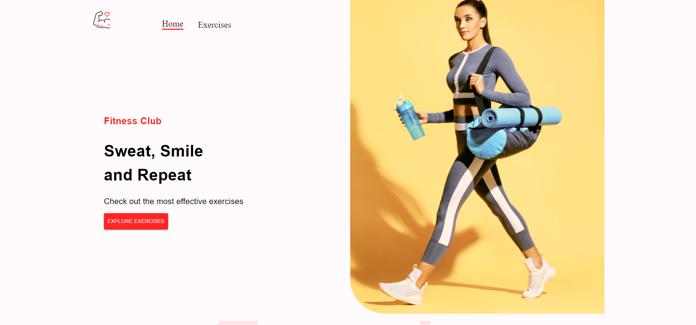

<!DOCTYPE html>
<html lang="en">

</head>
<body>
  <h1>Fitness App</h1>

  <h2>Overview</h2>
  
This React.js and Material-UI based fitness app utilizes Rapid API to fetch exercises categorized by body parts. It enhances user experience by integrating YouTube video references for each exercise, ensuring proper form and technique.

  <h2>Image</h2>
  
  <h2>Features</h2>
  <ul>
    <li><strong>Exercise Display:</strong> Browse exercises categorized by body parts (e.g., arms, legs).</li>
    <li><strong>YouTube Video References:</strong> Each exercise includes a link to a YouTube video for visual guidance.</li>
    <li><strong>Responsive Design:</strong> Optimized for various devices with a user-friendly interface.</li>
  </ul>

  <h2>Technologies Used</h2>
  <ul>
    <li>React.js</li>
    <li>Material-UI</li>
    <li>Rapid API</li>
  </ul>

  <h2>Installation</h2>
  <ol>
    <li>Clone the repository: <code>git clone https://github.com/your-username/fitness-app.git</code></li>
    <li>Navigate into the project directory: <code>cd fitness-app</code></li>
    <li>Install dependencies: <code>npm install</code></li>
    <li>Start the development server: <code>npm start</code></li>
  </ol>

  <h2>Usage</h2>
  <ul>
    <li>Select a body part to view relevant exercises.</li>
    <li>Click on an exercise to watch a related YouTube video for guidance.</li>
  </ul>

  <h2>View Live</h2>
  

    <a href="https://fitness-app-jade-psi.vercel.app/ target="_blank">View Live</a>
  

  <h2>Contributing</h2>
  
Contributions are welcome! Fork the repository and submit a pull request.

  <h2 class="contact">Contact</h2>
  
For inquiries, contact <a href="mailto:changansarvesh0@gmail.com">changansarvesh0@gmail.com</a>.

</body>
</html>
